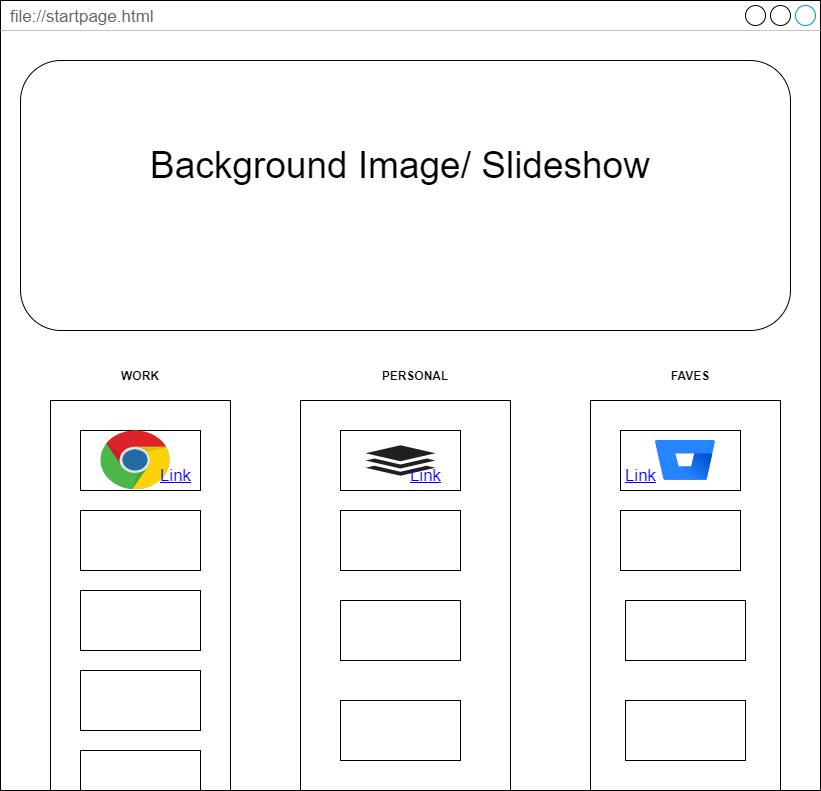

# INSTRUCTIONS 

## STEP ONE: Planning
*Planning is often one of the most important steps in most jobs. This step saves you massive amounts of time and personal misery.*

* 1) Draw Out a minimal design concept for how your page should look. By hand or with [Draw.io](https://app.diagrams.net/)
    - Example:
        